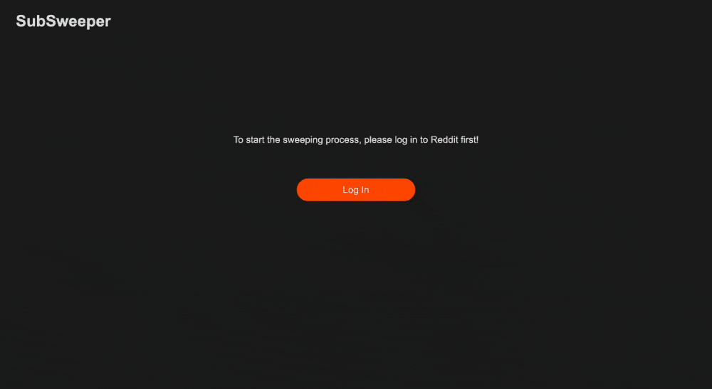

# SubSweeper 🧹

**SubSweeper** is a web application designed to help you clean your subreddit subscriptions with ease. If you're looking to unsubscribe from inactive subreddits or reduce clutter, SubSweeper is the tool you need.

## Features

- **Subscription Overview**: View all your subreddit subscriptions in one place.
- **Bulk Unsubscribe**: Select multiple subreddits and unsubscribe from them with a single click.
- _**TODO: Sort and Filter**: Quickly find specific subreddits using sort and filter options._

## Usage

1. Go to the SubSweeper website: https://elisezhg.github.io/SubSweeper/
2. **Login**: Log in with your Reddit account to allow SubSweeper to access your subscriptions.
3. **View Subscriptions**: Once logged in, you'll see all of your current subreddit subscriptions.
4. **Unsubscribe**: Select the subreddits you want to unsubscribe from and click the 'Unsubscribe' button.

  

